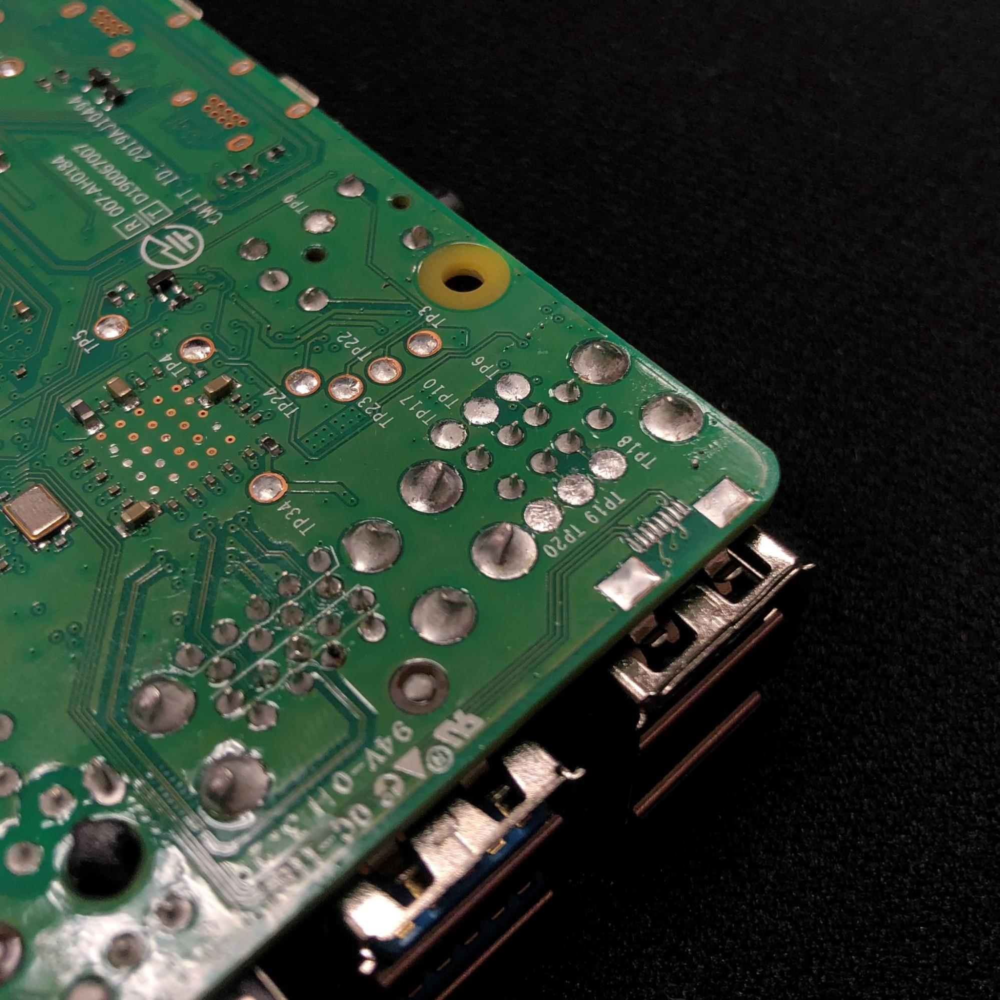
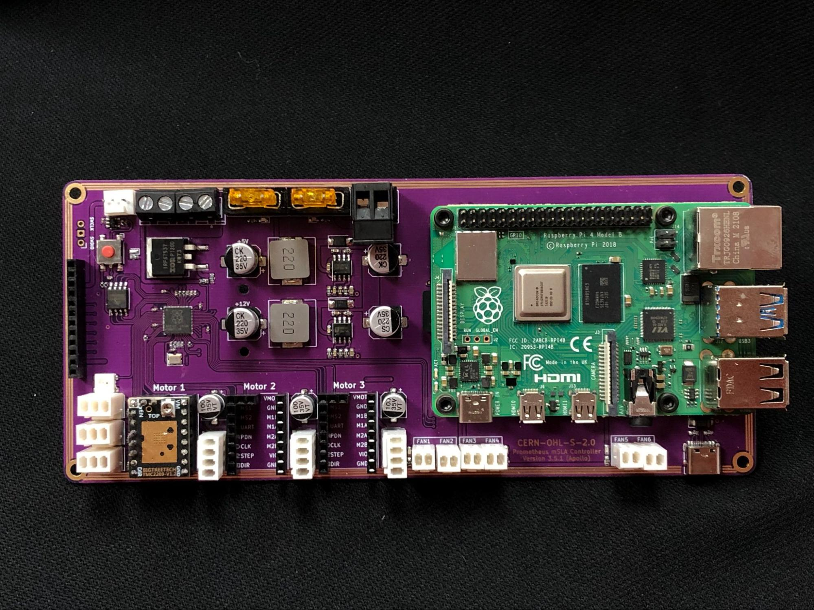
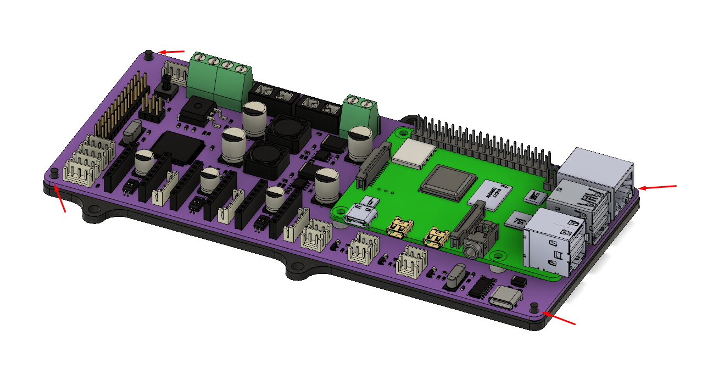

## Raspberry Pi Installation
The Prometheus MSLA controller board ( APOLLO ) is a carrier board for the raspberry pi 4B.
The communication and power transfer for the pi is made via spring pins ( pogo pins ). They
connect to pads under the pi for a seamless interface. The pogo pins are very fragile and precise
components so some of the pads on the pi need to be modified for a good connection, and to
reduce the risk of breaking them.

### Step1
With a good pair of flush cutters, cut the first 3 pins of the GPIO pins as flush as possible.
These pins are #2 - 4 - 6 (5V - 5V - GND )

### Step2 (optional)
With a small file or a soldering iron smooth the surface of these cut pins so the
pogo pins can have better contact on the pads.

It should look something like this.

### Step3
With a sharp point or a soldering iron, scrape or heat the contact test pads. This
procedure will ensure to remove any potential oxide layer that can prevent the pogo pins from
having a good connection to the pi.
<b>*The important pads are ( TP17, TP10, TP6 )</b>

### Step4
You can now carefully install the pi on the board using the 4 M2.5 screws.
Don’t over tighten the screws to prevent crushing the pogo pins (look at them while screwing).
<b>* We strongly suggest installing a proper heatsink on your pi.</b>

### Step5

The Apllo mother board can now be installed on the 3D printed braket. Simply Melt the four pillars on each corner to make some kind of plastic rivets.

