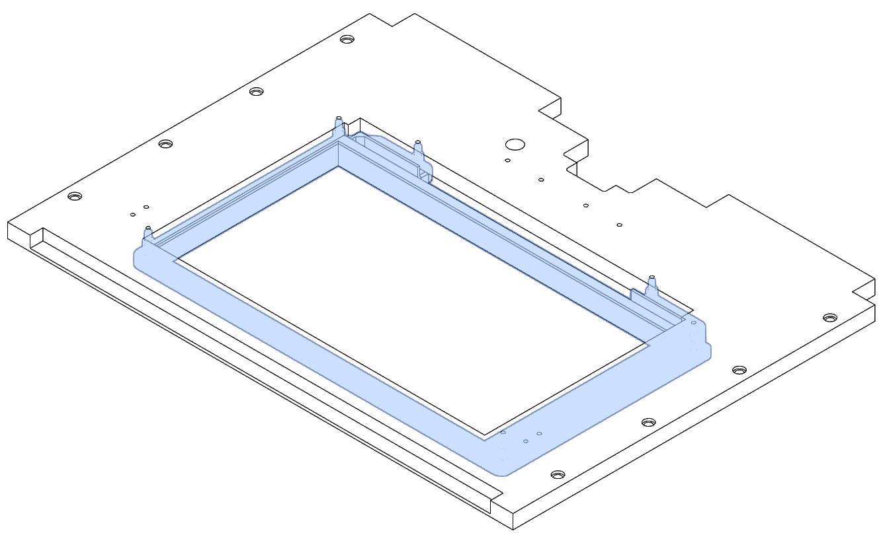
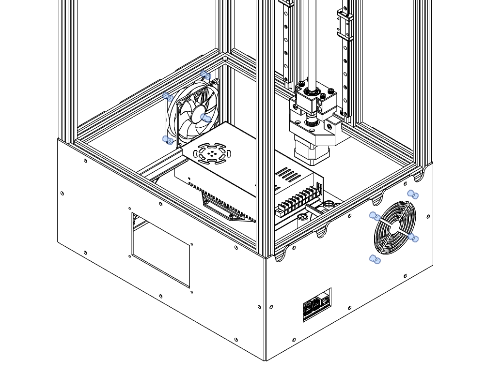
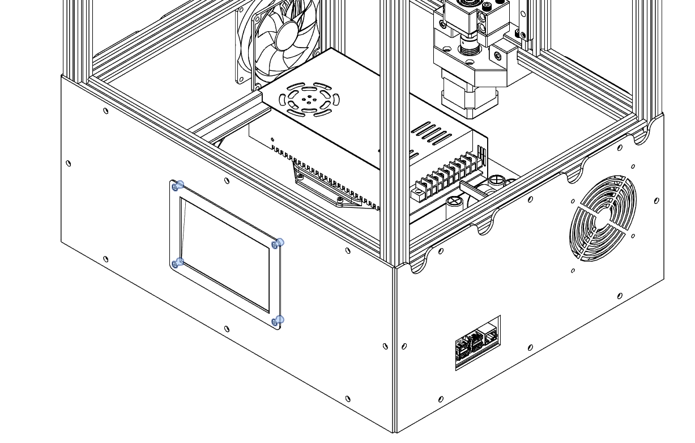
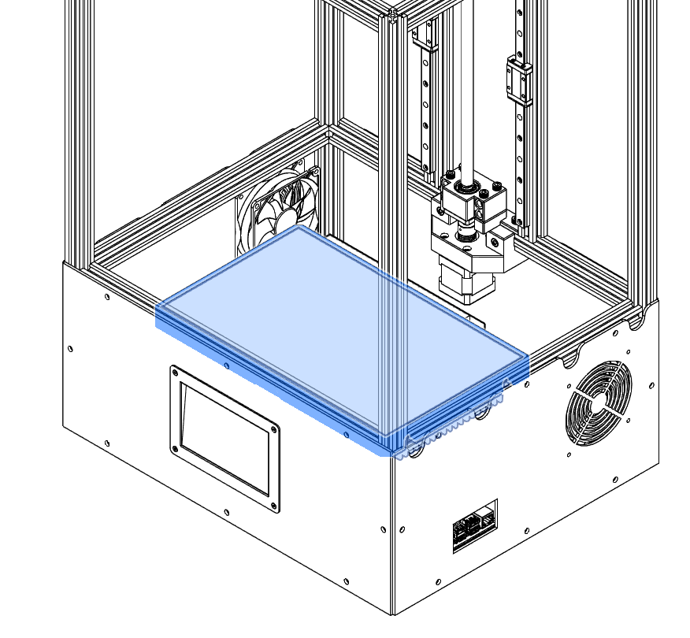
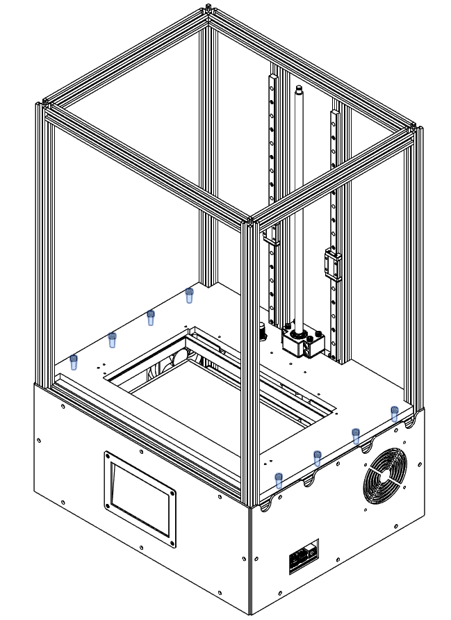
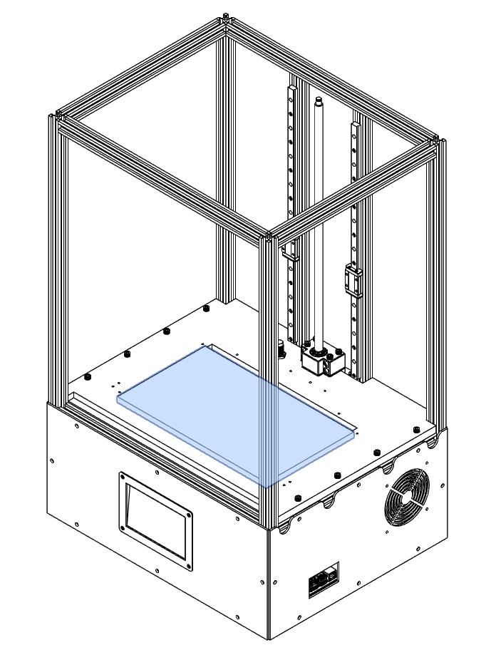

### LCD Braket

For the LCD assembly you will first need to install the screws and springs onto the 3D printed LCD Insert then install it under the Middle Plate. The holes on the Middle Plate should be already treaded.

M3X25 SHC (6)
Spring (6)

### Z Limit Switch

Install your inductive probe in the approate hole. The heigt of it can be fix later.

### Finishing The Electronic Bay

It's now time to install the firsts pannels in place. You can also install the fans and touch screen on the pannels before or after installing them on the frame of the printer.

M5 T-nut (32)
M5x8 SHC (32)

M3 nut (4)
M4 nut (8)
M3x10 counter sunk (4)
M4x10 SHC (8)

You can now sit the LED Array on the 3D printed LED Supports. It means that when it's all done you pretty much have everything in place to almost finish all the electrical connections.

### Leveling The LCD

The middle can be inserted in an angle into place starting by the back. You can wait before laying it flate and screwing the plate because it will be easier to level the LCD. You may need a little bit of force to fit it into place.

M5x16 SHC (8)

It's now time to install the LCD. Start by installing the glass pannel than on top the LCD. For the leveling first we suggest to level the glass pannel to the middle plate than lay the LCD on top so it can barely stick out. Make sure to center it as much as possible. Use opaque tape around the LCD so it can be fix in place and there is no light bleeding.

We suggest hockey tape because standard electrical tape can do the job but i can leave gummy risidue and fail over time.

??? info "You may need a spacer"

    We are living in a world where not everyone can say metric measurments are better. So your middle plate can be too thick or your glass pannel too thin. It's possible that even with the leveling screws all the way in the glass and LCD can not stick enough. The solution is to print and install a spacer on the LCD insert. 

Now install the vat latching system into place. Before tightening the screws we suggest to install the vat in place so we can align everything properly and tight the balldetent until the vat click in place and don't wobble. You can jump to the Vat assembly step before going to the next step.

M3x25 SHC (4)
M8x12 Balldetent (2)

### Finishing the Leveling

Now that everything is in place we will need to level the LCD to the FEP sheet. When the vat is in place you should not feel a gap between the FEP sheet and the LCD. To do so start by barely lift the LCD up using the leveling screws of the LCD insert. You should screw them until the LCD barely touch the FEP sheet. Make sure that the insert is properly leveled and the glass don't wobble. The tape you installed around the LCD will strech a bit.

When it's done you can finally fix the middle plate in place